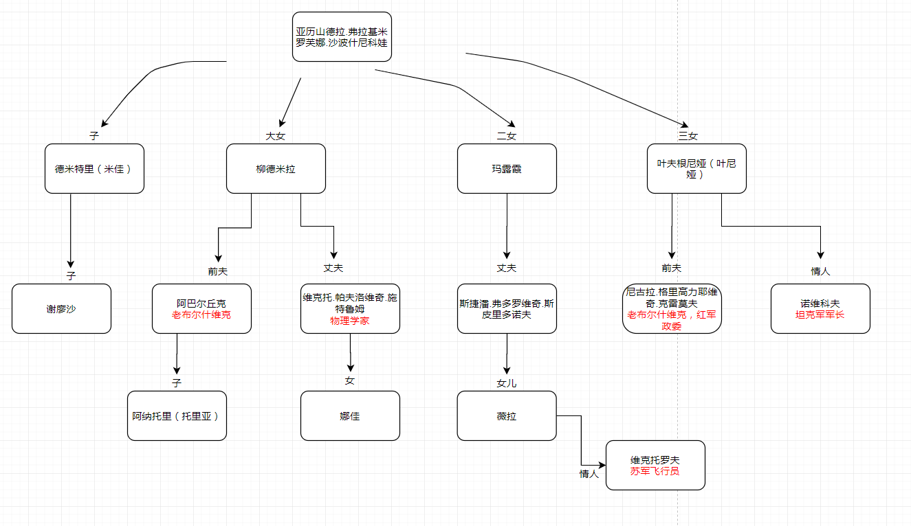

## 生活与命运
瓦西里.格罗斯曼 于 1960写成随即被苏联封禁  
但由于有备份手稿，被人运到西方于1980年在英语世界出版，1988年在苏联出版  

更多信息可以关注梁文道的<一千零一夜>或者维基百科  

### 第一部
占据了整篇35%左右的内容，沙波什尼科夫除了儿子都出现过了。  
维克托就是作者自己的代入，他的母亲也是被关进集中营死的(一千零一夜节目中知道的背景)

### 人物关系图

亚历山德拉.弗拉基米罗芙娜.沙波什尼科娃(有一子三女)

德米特里（米佳）----弗拉基米罗芙娜之子

谢廖沙（米佳之子）----弗拉基米罗芙娜之孙

柳德米拉----弗拉基米罗芙娜之大女

阿巴尔丘克----柳德米拉前夫。老布尔什维克

阿纳托里（托里亚）----柳德米拉与阿巴尔丘克之子

维克托.帕夫洛维奇.施特鲁姆----柳德米拉现任丈夫，苏联国家科学院物理学家

娜佳----柳德米拉与维克托之女

玛露霞----弗拉基米罗芙娜二女儿，死于斯大林格勒撤退沉船事故

斯捷潘.弗多罗维奇.斯皮里多诺夫----玛露霞丈夫

薇拉----玛露霞与斯皮里多诺夫之女

维克托罗夫----薇拉的情人，苏军飞行员

叶夫根尼娅（叶尼娅）----弗拉基米罗芙娜三女儿

尼古拉.格里高力耶维奇.克雷莫夫----叶尼娅前夫，老布尔什维克，红军政委

诺维科夫----叶尼娅的情人，坦克军军长
